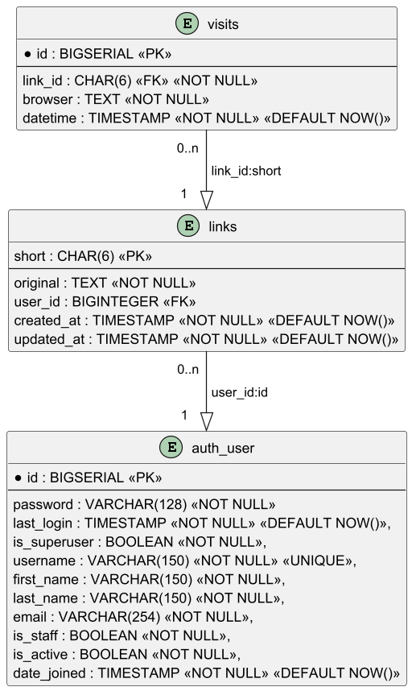

# SHORTENER
### Бекенд приложения для сокращения ссылок


#### Основные маршруты

* `/admin` - панель админа, на которой можно просмотреть содержание таблиц базы данных.
* `/api/schema/` - схема API в формате YAML.
* `/api/schema/swagger/` и корневой URL - интерактивная документация Swagger.
* `/api/schema/redoc/` - интерактивная документация в формате REDOC.

#### Схема базы данных и API



* **auth_user** - встроенная модель Django (используется для упрощения аутентификации). Методы:

-- `/api/users/register/` `POST` - создание нового пользователя и автоматическая авторизация. Тело запроса:

```
{
  "username": "string",
  "email": "user@example.com",
  "password": "string",
  "first_name": "string",
  "last_name": "string"
}
```

Обязательные поля: username, email, password. Уникальные поля: username, email.

Ответ:

```
{
  "id": 1,
  "username": "string",
  "email": "user@example.com",
  "first_name": "string",
  "last_name": "string",
  "date_joined": "2026-03-04T17:24:12.579Z"
}
```

-- `/api/users/login/` `POST` - вход по авторизационным данным:

```
{
  "username": "string",
  "password": "string"
}
```


-- `/api/users/logout/` `POST` - выход авторизованного пользователя.

-- `/api/users/profile/` `GET` - получение профиля авторизованного пользователя; ответ аналогичен `register`.

-- `/api/users/profile/` `PUT` - обновление (в т. ч. частичное) профиля пользователя:

```
{
  "username": "string",
  "email": "user@example.com",
  "first_name": "string",
  "last_name": "string"
}
```

-- `/api/users/profile/` `DELETE` - удаление профиля пользователя и всех связанных с ним ссылок (см. далее).


* **links** - таблица хранения и сопоставления коротких ссылок. Методы:

-- `/api/links/create/` `POST` - создание новой короткой ссылки. Доступно как авторизованному, так и неавторизованному
пользователю. При использовании неавторизованным пользователем user_id устанавливается в null. `short` - генерируемая
6-значная строка, создаваемая на основе конкатенации имени пользователя и исходной ссылки (`original`) (для уникальности
короткой ссылки для каждого пользователя), либо только оригинальной ссылки (для неавторизованных), либо, в случае
коллизий, конкатенации текущего момента времени и исходной ссылки. Тело запроса:

```
{
  "original": "string"
}
```

Ответ:

```
{
  "short": "string",
  "original": "string",
  "user": 0,
  "created_at": "2026-03-04T17:55:52.790Z",
  "updated_at": "2026-03-04T17:55:52.790Z"
}
```

Короткая ссылка должна формироваться на стороне клиента как `https://{имя хоста проекта}/{short}`.


-- `/api/links/qrcode/<short>` `GET` - возвращает объект формата `image/png` - QR-код, соответствующий
ссылке `https://{имя хоста проекта}/{short}`; Изображение при каждом запросе генерируется заново, на сервере не
хранится; метод общедоступен; необязательный query-параметр `size` задаёт условный размер изображения (по умолчанию 10).

-- `/api/links/get` `GET` - возвращает список сведений о ссылках, сгенерированных данным авторизованным пользователем.
Здесь и далее при возврате списков используется пагинация через параметры URL `limit` и `offset` (по умолчанию 10 и 0 
соответственно). Записи в списке аналогичны ответу при создании ссылки, за исключением нового поля `clicks` - количество
переходов по каждой ссылке (рассчитывается при запросе);

-- `/api/links/search/<keyword>` `GET` - полностью аналогично предыдущему запросу, но возвращает только те ссылки, в
оригиналах которых содержалась подстрока `keyword`.

-- `/api/links/update/<short>` `PUT` - обновляет оригинальную ссылку, соответствующую
короткой ссылке `short`; тело запроса аналогично при создании ссылки.

-- `/api/links/delete/<short>` `DELETE` - удаление записи о короткой ссылке `short`.


* **visits** - хранит записи о переходах по коротким ссылкам.

-- `/<short>` `GET` - попытка перехода по короткой ссылке `short`; в случае успеха
в таблице `visits` создаётся запись с данными о времени запроса и клиенте, в случае отсутствия
данной короткой ссылки возвращается страница 404.

-- `/api/links/get-visits/<short>` `GET` - возвращает с пагинацией список посещений по данной короткой ссылке `short`.


#### Возможные сценарии реализации фронтенда

1) Главная страница: строка ввода ссылки - после генерации - готовая для копирования короткая ссылка и QR-код. Также:
- Для неавторизованного - кнопки войти и зарегистрироваться - перенаправление на соответствующие страницы - возвращение
 на главную.
- Для авторизованного - кнопка "личный кабинет".

2) Личный кабинет: таблица с историей генерации ссылок (в общей таблице короткая, оригинальная ссылки и дата генерации, 
количество переходов, кнопка "удалить" и "изменить") и кнопка "изменить профиль". К таблице прилагается поисковая строка, при вводе в которую 
таблица обновляется в соответствии с результатами поиска.
3) Страница данной ссылки открывается при клике по ней в ЛК; на странице её QR-код и таблица с посещениями (из visits).
4) Страницы редактирования ссылки и редактирования профиля пользователя.